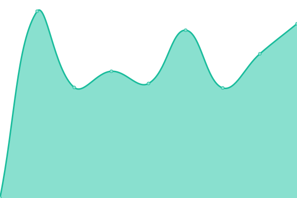

# [📈 Live Status](https://status.ejiek.com): <!--live status--> **🟧 Partial outage**

This repository contains the open-source uptime monitor and status page for [Vlad](https://ejiek.com), powered by [Upptime](https://github.com/upptime/upptime).

With [Upptime](https://upptime.js.org), you can get your own unlimited and free uptime monitor and status page, powered entirely by a GitHub repository. We use [Issues](https://github.com/ejiek/status/issues) as incident reports, [Actions](https://github.com/ejiek/status/actions) as uptime monitors, and [Pages](https://status.ejiek.com) for the status page.

<!--start: status pages-->
<!-- This summary is generated by Upptime (https://github.com/upptime/upptime) -->
<!-- Do not edit this manually, your changes will be overwritten -->
<!-- prettier-ignore -->
| URL | Status | History | Response Time | Uptime |
| --- | ------ | ------- | ------------- | ------ |
|  [ejiek.com](https://ejiek.com) | 🟩 Up | [ejiek-com.yml](https://github.com/ejiek/status/commits/HEAD/history/ejiek-com.yml) | 

 834ms
     
 | 

<a href="https://status.ejiek.com/history/ejiek-com">100.00%</a>
    

|  [Repository](https://repo.ejiek.com) | 🟩 Up | [repository.yml](https://github.com/ejiek/status/commits/HEAD/history/repository.yml) | 

 791ms
     
 | 

<a href="https://status.ejiek.com/history/repository">100.00%</a>
    

|  Data Center B | 🟩 Up | [data-center-b.yml](https://github.com/ejiek/status/commits/HEAD/history/data-center-b.yml) | 

 778ms
     
 | 

<a href="https://status.ejiek.com/history/data-center-b">100.00%</a>
    

|  Data Center V | 🟥 Down | [data-center-v.yml](https://github.com/ejiek/status/commits/HEAD/history/data-center-v.yml) | 

 0ms
     
 | 

<a href="https://status.ejiek.com/history/data-center-v">0.00%</a>
    

<!--end: status pages-->

[**Visit our status website →**](https://status.ejiek.com)

## 📄 License

- Code: [MIT](./LICENSE) © [Vlad](https://ejiek.com)
- Data in the `./history` directory: [Open Database License](https://opendatacommons.org/licenses/odbl/1-0/)
