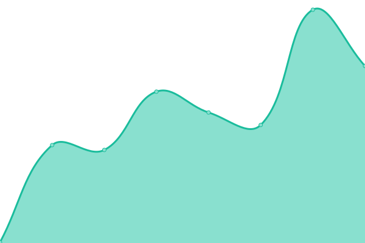
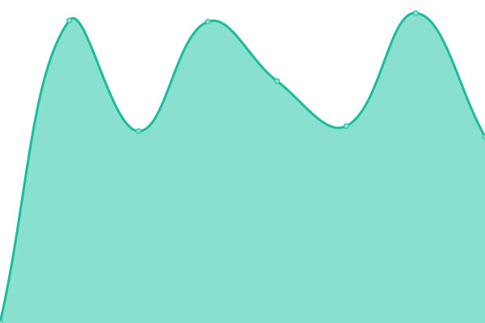

# [📈 Live Status](https://status.ejiek.com): <!--live status--> **🟩 All systems operational**

This repository contains the open-source uptime monitor and status page for [Vlad](https://ejiek.com), powered by [Upptime](https://github.com/upptime/upptime).

With [Upptime](https://upptime.js.org), you can get your own unlimited and free uptime monitor and status page, powered entirely by a GitHub repository. We use [Issues](https://github.com/ejiek/status/issues) as incident reports, [Actions](https://github.com/ejiek/status/actions) as uptime monitors, and [Pages](https://status.ejiek.com) for the status page.

<!--start: status pages-->
<!-- This summary is generated by Upptime (https://github.com/upptime/upptime) -->
<!-- Do not edit this manually, your changes will be overwritten -->
<!-- prettier-ignore -->
| URL | Status | History | Response Time | Uptime |
| --- | ------ | ------- | ------------- | ------ |
|  [ejiek.id](https://ejiek.id) | 🟩 Up | [ejiek-id.yml](https://github.com/ejiektpobehuk/status/commits/HEAD/history/ejiek-id.yml) | 

 191ms
     
 | 

<a href="https://status.ejiek.com/history/ejiek-id">100.00%</a>
    

|  Secret Artist | 🟩 Up | [secret-artist.yml](https://github.com/ejiektpobehuk/status/commits/HEAD/history/secret-artist.yml) | 

 1405ms
     
 | 

<a href="https://status.ejiek.com/history/secret-artist">100.00%</a>
    

|  Secret Upstream | 🟩 Up | [secret-upstream.yml](https://github.com/ejiektpobehuk/status/commits/HEAD/history/secret-upstream.yml) | 

 2209ms
     
 | 

<a href="https://status.ejiek.com/history/secret-upstream">100.00%</a>
    

<!--end: status pages-->

[**Visit our status website →**](https://status.ejiek.com)

## 📄 License

- Code: [MIT](./LICENSE) © [Vlad](https://ejiek.com)
- Data in the `./history` directory: [Open Database License](https://opendatacommons.org/licenses/odbl/1-0/)
